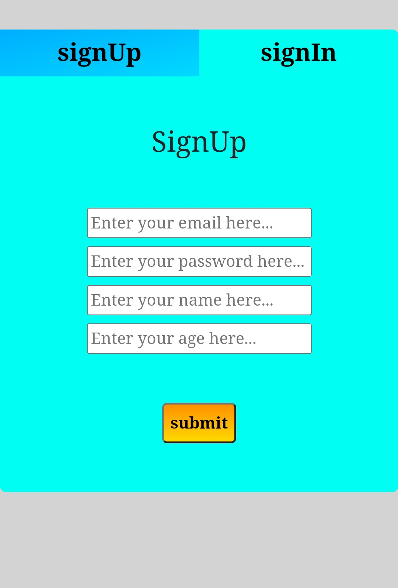
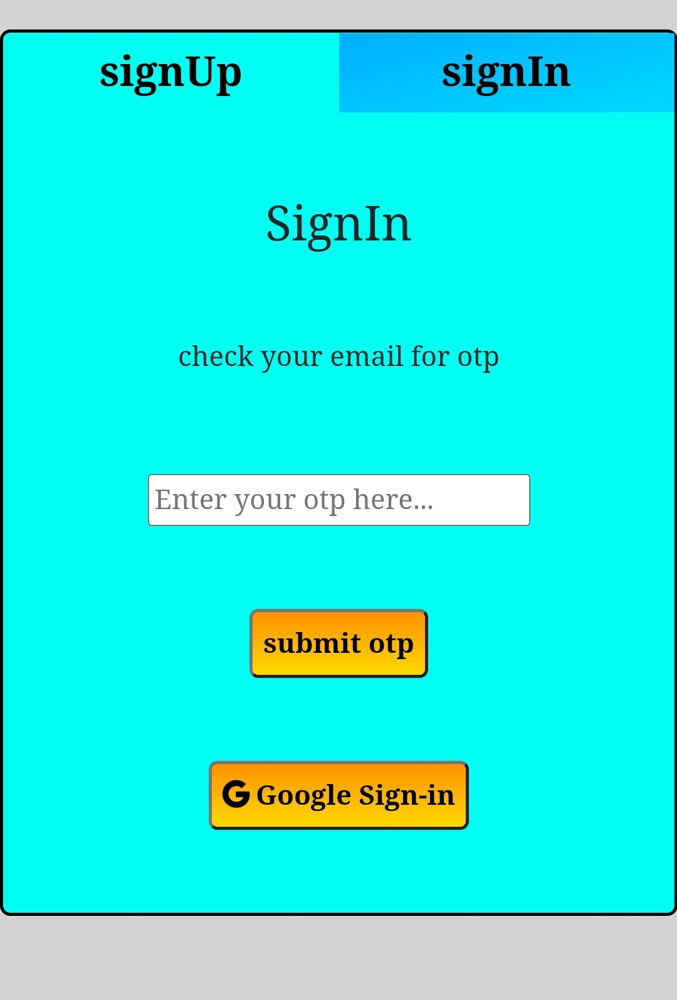
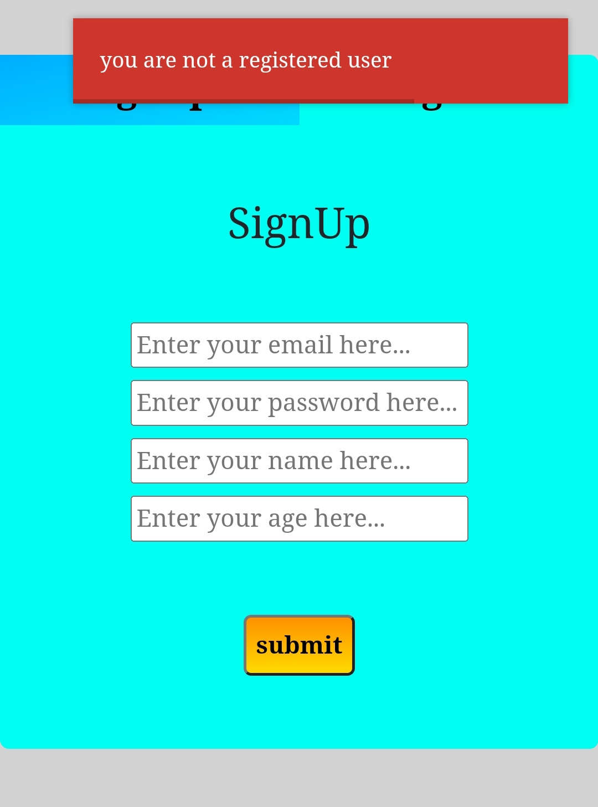
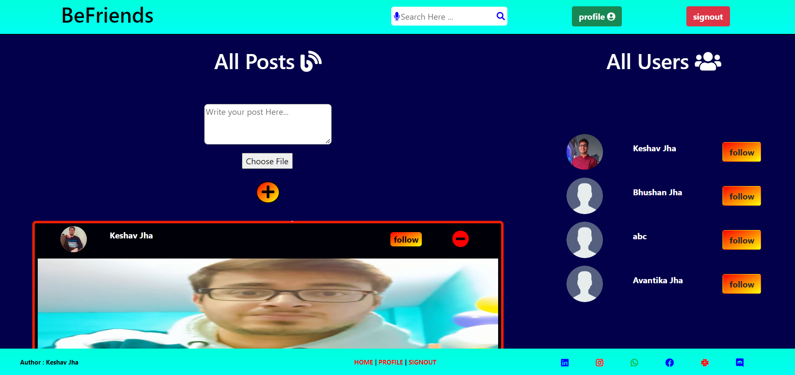
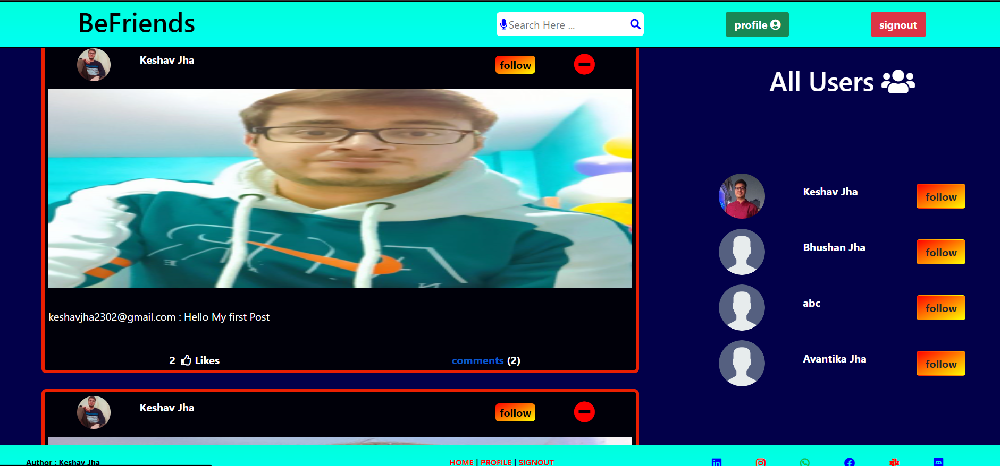
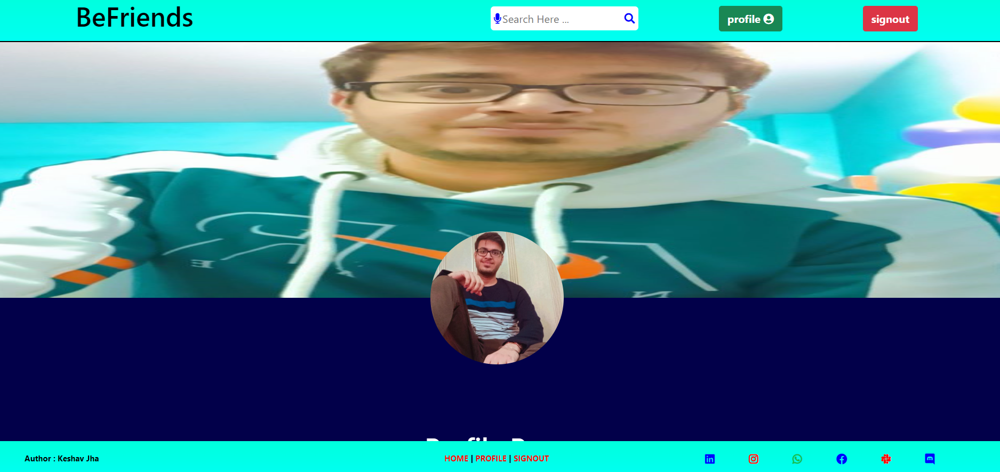
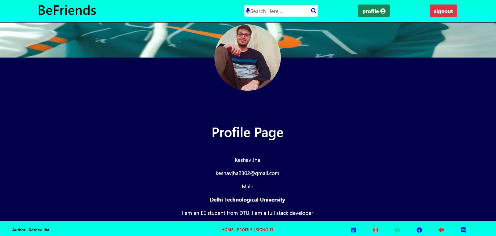

# Befriends
A social media website

## Overview of the Befriends project

Technology used is Nodejs, Expressjs

Pages you can visit on in this app

* Signup
* Signin
* Home
* Profile

### signin, signup pages

   

These pages uses passportjs library to authenticate users registeration is must before signin.
We can signin either through google signin or using the otp method. After entering the email the 6-digit otp will be sending to the email id so make sure that you are providing the correct gmail Id while registering.

## Home Page

   

We have an option to post something and the option to see the other users in home section we can like or comment any post that we like and while clicking on any user we will be moving to the profile page of that user.

## Profile page

   

Here we can add one desktop profile and secondly the cover photo in out profile image. We can also update our information along with this we will be having all the post done by us in our profile page itself.

## Deployment of Befriends (Heroku)

This app is deployed on the heroku portal so that we can use it. But being a free host we cann't store images on to the heroku cloud services. Whenever user logout it's images will be deleted by the heroku server. We cann't upload images through mobile in Heroku portal so while using this app make sure that we are using the laptop or PC to upload any image.

[Heroku link]([http://localhost:3800/user/signin](https://befriends-keshav.herokuapp.com/))

